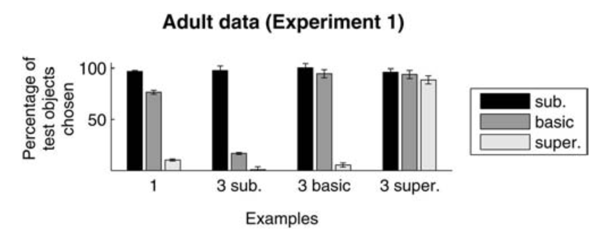

  
******
******

Replication of Xu and Tenenbaum 2007a, Experiment 1. N = 50 participants (original: N = 22).

```{r setup, include = F}
rm(list=ls())

# load packages
library(knitr)
library(rmarkdown)
library(broom)
library(tidyverse) 
library(langcog)
library(jsonlite)
library(stringr)
source("../../../analysis/useful_ML.R")

opts_chunk$set(echo = T, message = F, warning = F, 
               error = F, cache = F, tidy = F, fig.height = 4)
```  

### Read in raw data and anonymize
```{r, eval = F}
files = dir("../production-results/")
d = data.frame()
for (i in 1:length(files)[1]) {
    s <- fromJSON(paste("../production-results/", files[i], sep = ""))
    s$answers$asses = ifelse(is.null(s$answers$asses), "NA", s$answers$asses)
    d = rbind(d, data.frame(s))
}
names(d) <- str_replace(names(d), "answers.", "")
d.anonymized <- anonymize.sids(d, "WorkerId")

#write.csv(d.anonymized, "exp1_A.csv")
```

### Munge
```{r}
d = read.csv("exp1_A.csv")

d.long = d %>%
  gather(variable, value, contains("_")) %>%
  mutate(trial_num =  unlist(lapply(strsplit(as.character(variable),
                                      "_T"),function(x) x[2])),
         variable = unlist(lapply(strsplit(as.character(variable),
                                      "_"),function(x) x[1]))) %>%
  spread(variable, value) %>%
  mutate(trial_num = as.numeric(trial_num)) %>%
  mutate_if(is.character, funs(as.factor)) 

d.munged = d.long %>%
          select(subids, trial_num, category, condition, selected) %>%
          mutate(selected = lapply(str_split(selected, ","), 
                                   function(x) {str_sub(x, 4, 6)})) %>%
          mutate(prop_sub = unlist(lapply(selected, function(x){sum(x == "sub")/2})),
                 prop_bas = unlist(lapply(selected, function(x){sum(x == "bas")/2})),
                 prop_sup = unlist(lapply(selected, function(x){sum(x == "sup")/4}))) %>%
          select(-selected)
```

Write long data to csv.
```{r, eval = F}
d.munged$exp = 1
#write.csv(d.munged, "../../../data/exp1_data_munged.csv", row.names = F)
```

### Reproduce XT2007a Figure 5.
```{r, fig.width = 8}
ms = d.munged %>%
  gather(variable, value, c(prop_sub, prop_bas, prop_sup)) %>%
  group_by(condition,variable) %>%
  mutate(value = as.numeric(value)) %>%
  multi_boot_standard(column = "value")  %>%
  mutate(variable = as.factor(variable))

ms$variable = factor(ms$variable,levels(ms$variable)[c(2,1,3)])
ms$condition = factor(ms$condition,levels(ms$condition)[c(1,3,2,4)])
ms$condition = plyr::mapvalues(ms$condition,
                               from = c("one", "three_basic", 
                                        "three_subordinate",
                                        "three_superordinate"), 
                               to = c("1", "3 basic", "3 sub.", "3 super."))

ggplot(ms, aes(x = condition, y = mean, group = variable, fill = variable)) +
  geom_bar(position = "dodge", stat = "identity") +
  geom_linerange(aes(ymin = ci_lower, 
                     ymax = ci_upper), 
                 position=position_dodge(width = .9)) +
  ylab("Proportion of \ntest objects chosen") +
  xlab("Examples") +
  theme_bw() +
  theme(legend.title = element_blank())
```



#### By category
```{r, fig.width = 9, fig.height = 3}
ms = d.munged %>%
  gather(variable, value, c(prop_sub, prop_bas, prop_sup)) %>%
  mutate(variable = as.factor(variable)) %>%
  group_by(condition,variable,category) %>%
  mutate(value = as.numeric(value)) %>%
  multi_boot_standard(column = "value") 

ms$variable = factor(ms$variable,levels(ms$variable)[c(2,1,3)])
ms$condition = factor(ms$condition,levels(ms$condition)[c(1,3,2,4)])
ms$condition = plyr::mapvalues(ms$condition,
                               from = c("one", "three_basic", 
                                        "three_subordinate", "three_superordinate"), 
                               to = c("1", "3 basic", "3 sub.", "3 super."))

ggplot(ms, aes(x = condition, y = mean, group = variable, fill = variable)) +
  facet_grid(~category) +
  geom_bar(position = "dodge", stat = "identity") +
  geom_linerange(aes(ymin = ci_lower, 
                     ymax = ci_upper), 
                 position=position_dodge(width = .9)) +
  ylab("Proportion of \ntest objects chosen") +
  xlab("Examples") +
  theme_bw() +
  theme(legend.title = element_blank())
```

### Post-task questions
```{r}
d %>%
  group_by(education) %>%
  summarise(n = n()) %>%
  kable()

d %>%
  group_by(enjoyment) %>%
  summarise(n = n()) %>%
  kable()

d %>%
  mutate(language = tolower(language)) %>%
  group_by(language) %>%
  summarise(n = n()) %>%
  kable()

d %>%
  group_by(gender) %>%
  summarise(n = n()) %>%
  kable()

d %>%
  group_by(asses) %>%
  summarise(n = n()) %>%
  kable()

d %>%
  mutate(age = as.numeric(as.character(age))) %>%
  ggplot(aes(x= age)) +
  geom_histogram() +
  theme_bw() +
  ggtitle("Age distribution")

unique(d$comments)
```

